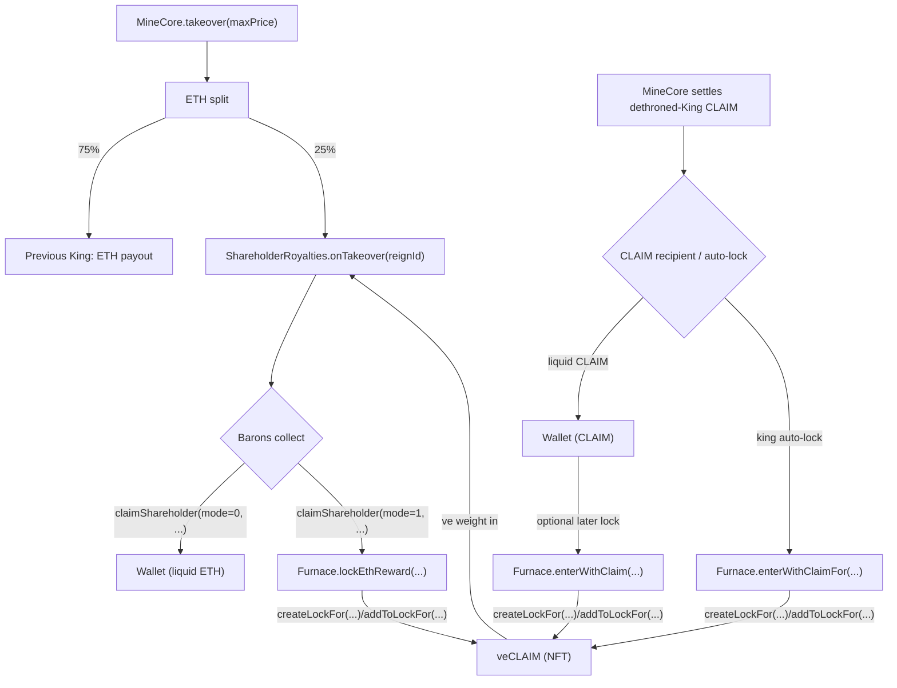
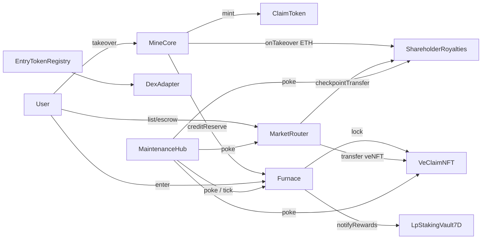

# Protocol Overview

ClaimRush is an onchain king-of-the-hill game on Base. Two loops drive the protocol — the Crown loop and the Furnace loop — connected by a single value flow called the CLAIM stream. This page explains the architecture from a contract-interaction perspective.

## The CLAIM stream (developer view)

The CLAIM stream is the end-to-end value flow through the protocol. ETH enters via takeovers, splits between the King and Barons, CLAIM is mined, locked in the Furnace with a bonus, and veCLAIM earns royalties from future takeovers. Understanding this flow is key to integrating with any part of the protocol.

**Flow summary:**

A player calls `MineCore.takeover(maxPrice)` (or `takeoverWithToken(...)` for allowlisted tokens). The ETH splits: 75% to the dethroned reign's configured ETH recipient (`reignEthRecipient[prevReignId]`, defaulting to the previous King), 25% to `ShareholderRoyalties.onTakeover(reignId)`.

ShareholderRoyalties records the ETH and auto-attempts indexing against total veCLAIM. If that push reverts, MineCore retains the ETH in `shareholderEthPending` until `retryPushShareholderEth()` succeeds. If the push succeeds but the ve checkpoint is stale, the ETH stays queued in `pendingShareholderETH` until a later flush.

Barons collect via `claimShareholder(mode=0, ...)` (Collect ETH) or `claimShareholder(mode=1, ...)` (Collect & Lock -> `Furnace.lockEthReward(...)`).

When a reign is finalized, MineCore settles the dethroned King's accrued CLAIM — either minting liquid CLAIM to the configured recipient, or routing it through `Furnace.enterWithClaimFor(...)` if king auto-lock is enabled. A user holding liquid CLAIM can lock later via `Furnace.enterWithClaim(...)`.

Every successful Furnace path creates or tops up veCLAIM through the Furnace-only `createLockFor(...)` / `addToLockFor(...)` surfaces, and that veCLAIM earns a share of future royalties.

## The two loops

**Crown loop (MineCore):** A player calls `takeover(maxPrice)` with ETH to become King. While King, they mine CLAIM via the emission stream. When dethroned, they receive 75% of the next takeover's ETH. See [Core Mechanics](core-mechanics.md) for pricing, routing, and emission formulas.

**Furnace loop (Furnace + ShareholderRoyalties):** A player calls `enterWithEth(...)`, `enterWithClaim(...)`, or `enterWithToken(...)` on the Furnace to lock CLAIM with a bonus and receive veCLAIM. As a veCLAIM holder (Baron), they earn ETH royalties from every takeover via `ShareholderRoyalties`. They can compound by collecting in mode 1 (Collect & Lock), which routes ETH back through the Furnace via `lockEthReward(...)`. Existing locks earn additional bonuses when extended (`extendWithBonus`); AutoMax locks accrue these automatically via `claimAutoMaxBonus` (permissionless, 24h onchain cooldown; official keeper triggers per settlement period per owner, daily by default). See [Furnace](furnace.md) and [Royalties](shareholderroyalties-barons.md).

## Recommended UI defaults

These are recommended integration defaults. They are not onchain rules, and integrators may choose different defaults.

**Entry token defaults:** Default order is CLAIM if CLAIM balance > 0, else ETH if ETH balance > 0, else WETH if WETH balance > 0, else the first enabled custom token with a positive balance, else CLAIM fallback. Collect & Lock always uses ETH because shareholder rewards enter the Furnace as ETH.

**Royalty action defaults:** Default to **Collect ETH** (mode 0) for a liquid payout. Offer **Collect & Lock** (mode 1) as the optional compounding path when locking is enabled; fall back to Collect ETH when locking is paused.

**Takeover entry:** Takeovers are priced in ETH. The protocol also supports an optional token entry path (`MineCore.takeoverWithToken`) which swaps an allowlisted token to ETH before executing the takeover.

**Do not send ETH directly to MineCore.** `MineCore` exposes a restricted `receive()` function that **only accepts ETH from the configured wrapped-native (WETH) contract** — needed because the `takeoverWithToken*` family ends with `IWETH.withdraw(...)`, which forwards ETH back to MineCore via `receive()`. Any other sender (a normal wallet, an arbitrary contract, etc.) reverts with `Errors.NotAuthorized()`. The only way untracked ETH can still land on `MineCore` is via paths that bypass `receive()` entirely — `selfdestruct` to MineCore, or a coinbase/forced send. Such ETH has **no bookkeeping**: it is **not** credited to `kingEthBalance`, `refundEthBalance`, or the shareholder index. The only recovery surface is the owner-only `rescueEth(to)`, which is gated to forward strictly the surplus over `shareholderEthPending + totalKingEthOwed + totalRefundEthOwed` (so it can never touch tracked liabilities). Indexers that sum pull-payment buckets and then compare to `address(mineCore).balance` will see a discrepancy when this happens; they should treat `address(this).balance - (sum of buckets + outstanding carry)` as unsolicited and ignore it. All user-triggered ETH flows must go through the documented entrypoints (`takeover`, `takeoverWithToken`, `withdrawKingBalance[To]`, `withdrawRefundBalance`).

## Contract map

The Upgradeability column matches the Security page statuses. Before the ceremony, proxy-backed contracts show "Yes" and standalone peripherals show "Redeploy". After the freeze-and-burn ceremony, statuses change as noted. See [freeze-and-burn-finality.md](freeze-and-burn-finality.md) for the full before/after table.

**Core (v1.0.0):**

| Contract | Purpose | Upgradeability |
|----------|---------|----------------|
| ClaimToken | ERC20 CLAIM | No |
| VeClaimNFT | ERC721 veCLAIM lock positions | No |
| MineCore | Reigns, takeovers, emissions | Yes → No |
| Furnace | Entry → lock (bonus + LP top-up) | Yes → No |
| ShareholderRoyalties | ETH-per-ve index (Barons) | Yes → No |
| MarketRouter | Lock management (0% fee, CLAIM prices) | Yes → No |
| MineCoreQuoter | Token-takeover quote + route resolver | Redeploy |
| FurnaceQuoter | Heavy view math for Furnace quotes | Redeploy → No |
| LpStakingVault7D | Stake Aerodrome LP → harvest CLAIM | Redeploy → No |

**Supporting:**

| Contract | Purpose | Upgradeability |
|----------|---------|----------------|
| FurnaceEntryTokenRegistry | Per-surface allowlist + routing | Redeploy → Configurable |
| MineCoreEntryTokenRegistry | Per-surface allowlist + routing | Redeploy → Configurable |
| DexAdapter | Aerodrome v2 router wrapper | Redeploy → Configurable |
| DelegationHub | Opt-in bot sessions (EIP-712) | Redeploy → Configurable |
| MaintenanceHub | Permissionless upkeep batching | Redeploy |
| ClaimAllHelper | Stateless bundler for Collect ETH / Collect & Lock | Redeploy → No |
| AgentLens | Onchain snapshot bundler for agents | Redeploy |
| TimelockController | Governance delay enforcement | No |

**Genesis:**

| Contract | Purpose | Upgradeability |
|----------|---------|----------------|
| LaunchController | One-shot genesis finalization | Retired |
| GenesisLPVault24M | 24-month LP lock vault | No |

## Data flow (contract-level)

`MaintenanceHub.poke(args)` also drives `Furnace.tick()` best-effort, so LP-stream accrual and overflow-drip maintenance can advance even when no user entry or sellback happens in that block.

## Launch timeline

Sequence: deploy → wire → launch → ownership finalization (transfer to timelock) → timelock bootstrap → verification → schedule freeze-and-burn finality → wait timelock delay → execute finality batch.

The protocol is fully playable from launch. `ClaimToken` and `VeClaimNFT` are permanent direct roots. `MineCore`, `Furnace`, `MarketRouter`, and `ShareholderRoyalties` are proxy-backed runtime contracts, so the live game can be repaired without changing its canonical addresses during the governed launch window. `ClaimToken` freezes at wire time and its ownership is renounced immediately (it has no post-freeze owner knobs). Permanent finality arrives when the timelocked freeze-and-burn batch freezes the remaining four freeze-gated contracts (`MineCore`, `Furnace`, `VeClaimNFT`, `ShareholderRoyalties`) and burns the four runtime `ProxyAdmin`s. That timelock delay is the public countdown to finality.

During genesis, `MineCore.guardian` may be the `LaunchController` contract for the one-shot finalization path. That is a bounded launch exception, not a reusable long-term guardian power.

## Trust boundaries

The five-tier role taxonomy:

| Tier | Surface | After finality |
|---|---|---|
| **Direct permanent roots** | `ClaimToken`, `VeClaimNFT` | unchanged (no proxy, no upgrade authority) |
| **Upgradeable runtime quartet** | `MineCore`, `Furnace`, `MarketRouter`, `ShareholderRoyalties` | proxy admins burned; addresses stay canonical |
| **Owner-managed (timelock)** | wiring setters with no freeze gate (MarketRouter, EntryTokenRegistry), peripherals (delegationHub, entryTokenRegistry, guardian rotation), operational allowlists (settlement/compound/harvest keepers), `MarketRouter` break-glass settlement, LP fee harvest | governance-delayed; not frozen |
| **Guardian-managed** | pause/unpause on takeovers / locking / trading, `EntryTokenRegistry.setTokenEnabled(token, false)` (disable-only), emergency `setGuardian` rotation | unchanged |
| **Permissionless** | `MaintenanceHub.poke(args)`, `Furnace.tick()`, `ShareholderRoyalties.flushPendingShareholderETH()` | unchanged |

For the canonical per-contract status mapping (Yes / No / Configurable / Redeploy / Retired), the freeze table, and the runtime safeguards that constrain owner power even before finality, see [Freeze-and-Burn Finality](freeze-and-burn-finality.md) and [Security, Guardian, Pausing](security-guardian-pausing.md).

## Wiring safety model

Protocol contracts do not trust raw stored pointers in isolation. Three layers of checks defend every wiring root: runtime canonical-bundle gates, admin-time candidate validation, and EIP-7702-aware ownership transfer.

### Runtime canonical-bundle gates

Every state-changing path resolves its dependencies through live cross-checks — verifying that `Furnace`, `MarketRouter`, `MineCore`, `VeClaimNFT`, `ClaimToken`, and `ShareholderRoyalties` still agree on one canonical bundle before proceeding. If any root has drifted, the call reverts `Errors.WiringMismatch` ("fails closed on bundle drift").

This pattern applies to settlement, delegation, royalty checkpointing, auto-compound execution, and MaintenanceHub upkeep. Individual pages note where the check applies; the invariant is always the same: no split-brain deployments can silently mutate accounting.

### Admin-time candidate validation

Every wiring setter that takes a contract address validates the candidate at admin time with three layers of checks:

1. Reject `address(0)`.
2. Reject bare EOAs (`code.length == 0` → `Errors.NotAContract()`).
3. Reject EIP-7702 delegated EOAs (23-byte runtime starting with `0xEF 0x01 0x00`). Most contracts revert this third case with `Errors.DelegatedEOA()` (`Furnace`, `VeClaimNFT`, `ClaimToken`, `EntryTokenRegistry`, `DexAdapter`, `FurnaceQuoter`, `ClaimAllHelper`, `GenesisLPVault24M`); `MineCore` and `MaintenanceHub` collapse the same case onto `Errors.NotAContract()` instead.

Setters whose target exposes a canonical back-pointer also enforce a reciprocal-binding check at admin time — for example, `Furnace.setMineCore(core)` requires `core.furnace()` to be either `0` (pre-wire) or equal to the calling Furnace, and `Furnace.setDelegationHub(hub)` requires `MineCore.{furnace,delegationHub,claim,ve}` to already point at the canonical bundle. See each contract's "Operator notes" section for the full table.

### Ownership transfer (EIP-7702 boundary)

Ownership transfer enforces the same EIP-7702 boundary along two parallel rails: proxy-backed contracts validate through the `UpgradeableProtocolBase._validateNewOwner` virtual hook (which reverts `DelegatedEOAOwner`); `Ownable2Step` direct contracts override `transferOwnership` to call `_rejectDelegatedEOA` locally (reverts `DelegatedEOA`). `Furnace` overrides the hook to a no-op for EIP-170 budget reasons and concentrates the protection at the proxy admin seat and the deploy-time owner-Safe pinning.

For the per-contract variant table and the mixed-authority owner branches, see [Security, Guardian, Pausing — EIP-7702 designator rejection](security-guardian-pausing.md#eip-7702-designator-rejection).

## See also

- [Core Mechanics](core-mechanics.md) — takeover loop, emission schedule, Baron royalties
- [Getting Started](getting-started.md) — deployed addresses and SDK setup
- [Runtime Proxy Upgrades](runtime-proxy-upgrades.md) — live upgrade procedure for the proxy-backed runtime quartet
- [Security, Guardian, Pausing](security-guardian-pausing.md) — governance model and role hierarchy
- User manual: [Core Concepts](https://docs.claimru.sh/core-concepts)
