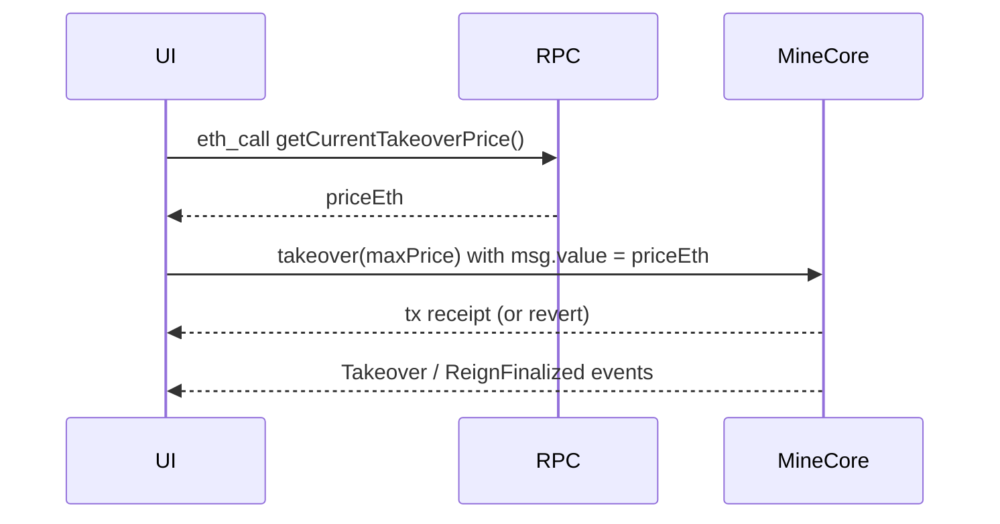

# Build a Crown price widget + takeover call

**Where this fits:** Crown loop in the [CLAIM stream](../protocol-overview.md) · Contract: [Core Mechanics](../core-mechanics.md)

Goal:
- display the live takeover price in your UI
- submit a takeover transaction using the default tight-value flow (send the **current cost**, handle contention reverts)

## What you will use

- `MineCore.getCurrentTakeoverPrice()` (preferred for a live quote)
- `MineCore.getTakeoverPrice(uint256 timestamp)` (optional, arbitrary timestamp quote)
- `MineCore.takeover(maxPrice)` (ETH entry)
- `MineCore.takeoverWithToken(tokenIn, amountIn, minEthOut, maxPrice)` (token entry; uses an internal `block.timestamp + SWAP_DEADLINE_SECONDS` swap deadline)
- `MineCore.takeoverWithTokenAndDeadline(tokenIn, amountIn, minEthOut, maxPrice, deadline)` (token entry with a **caller-supplied absolute swap deadline**; preferred for MEV-sensitive submissions)
- `deployments/<network>.json` (MineCore address)

## Flow



## Steps

### 1) Read the price from chain

Preferred:
- call the live quote helper: `getCurrentTakeoverPrice()`

Alternative:
- call `getTakeoverPrice(block.timestamp)` if you already have a canonical timestamp source

Fallback (only if you must):
- implement the formula from [Core mechanics](../core-mechanics.md) using:
  - `referencePrice`
  - `currentReignStartTime`

### 2) Provide the default takeover UX (no max price input)

Between takeovers, the takeover cost **only decays downward**.

The only meaningful race condition for the ETH path is:
- someone else takes over before your tx confirms
- the cost doubles (referencePrice = 2× last paid price)
- your tx reverts because `msg.value` is now below the required price

Recommended UI pattern:
- show `priceEth` (live)
- show a short contention note:
  - “If someone takes over first, your takeover can revert. Refresh and retry.”
- provide an explicit **Refresh quote** action

### 3) Submit the transaction (ETH path)

Recommended call (default UX):
- `MineCore.takeover(priceEth)` with `msg.value = priceEth` (tight value, `maxPrice` = quoted price)

Behavior:
- MineCore charges the current price at execution time.
- If the price decays further before execution, any excess is refunded/credited.
- If the Crown moves (someone else takes over first), the price doubles and your tx reverts with `PriceExceeded`.

After confirmation:
- refresh UI from onchain state (do not rely on optimistic updates)

If it reverts under contention:
- refresh the quote
- show a clear reason (ex: “Crown moved” / “Someone took over first”)
- offer a single-transaction retry

### 4) Token takeover path (optional, advanced)

Two variants are exposed by MineCore:

- `takeoverWithToken(tokenIn, amountIn, minEthOut, maxPrice)` — the swap deadline is set internally to `block.timestamp + SWAP_DEADLINE_SECONDS` (currently 300s). Convenient default for non-MEV-sensitive flows.
- `takeoverWithTokenAndDeadline(tokenIn, amountIn, minEthOut, maxPrice, deadline)` — the caller passes an absolute `deadline` (unix timestamp). MineCore reverts `DeadlineExpired` if `block.timestamp > deadline` before the swap executes. **Prefer this variant for MEV-sensitive submissions** (private-relay routing, intentionally short caller-supplied deadlines), as called out by the contract NatSpec on `takeoverWithToken`.

If you support either variant:
- label it as Advanced
- always show the canonical ETH price line alongside the token estimate
- disclose that leftover value is returned in **ETH** (not the input token)

Safety requirements:
- the token must be allowlisted in the `EntryTokenRegistry` wired to MineCore (`MineCore.entryTokenRegistry()`); otherwise the call reverts
- require `minEthOut` to protect against poor execution / MEV
- pass `maxPrice` to guard against paying more than expected for the takeover itself
- for `takeoverWithTokenAndDeadline`, choose `deadline` tight enough that a delayed inclusion fails fast rather than executing at a stale spot price

**Watch out:** Token takeovers route through an onchain DEX swap. Without a tight `minEthOut`, MEV bots can sandwich the swap and the user receives significantly less value. Always derive `minEthOut` from the quoted `ethOut` and an explicit slippage policy. For MEV-sensitive flows, also use `takeoverWithTokenAndDeadline` and submit via a private relay — the internal `SWAP_DEADLINE_SECONDS` buffer used by `takeoverWithToken` is still derived from `block.timestamp`, so it does not provide strong MEV protection on its own.

Canonical quoting (recommended):
- use `MineCoreQuoter.quoteTakeoverWithToken(tokenIn, amountIn)` to get:
  - `ethOut` (expected post-swap ETH credited to the takeover flow)
  - `takeoverPrice` (current takeover price for comparison)
- compute `minEthOut` from an explicit slippage policy:
  - `minEthOut = ethOut * (10_000 - slippageBps) / 10_000`
  - optional stricter guard: clamp `minEthOut >= takeoverPrice`

SDK example (local):

```bash
RPC_URL=http://127.0.0.1:8545 \
  npm -C agents/sdk run example:takeover-token-quote
```


### 5) Update UI from events (optional but recommended)

- listen for MineCore events:
  - `Takeover`
  - `ReignFinalized`

Use events to:
- update the current King
- append to the reign history list

## What success looks like

- The UI shows a takeover price that matches `MineCore.getCurrentTakeoverPrice()`.
- The UI sends the **current cost** (no user-entered max).
- Under contention, the UX clearly explains the revert and drives a retry.

## See also

- Canonical pricing details: [Core mechanics](../core-mechanics.md)
- Event decoding: [Events and indexing](../events-and-indexing.md)
