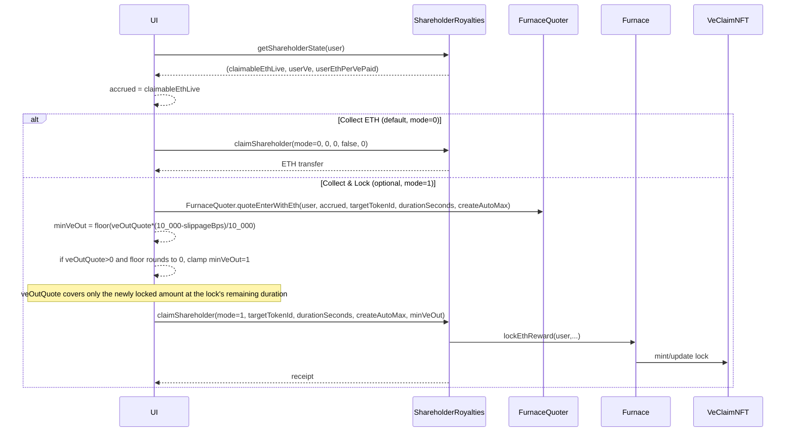

# Collect Barons rewards: Collect ETH (default) or Collect & Lock (optional)

**Where this fits:** Furnace loop in the [CLAIM stream](../protocol-overview.md) · Contract: [ShareholderRoyalties](../shareholderroyalties-barons.md)

Goal:
- Show a user their accrued Barons ETH (royalties)
- Default: **Collect ETH** (mode 0); **Collect & Lock** remains optional when locking is enabled
- Optional: **Collect & Lock** (mode 1, compounding via Furnace when locking is enabled)

UI recommendation:
- Primary CTA: **Collect ETH** (mode 0). Show **Collect & Lock** as secondary when `Furnace.lockingPaused == false`
- Secondary CTA: **Collect & Lock** (mode 1)
- If you store preferences, “remember my choice” is fine, but hard-disable mode 1 when locking is paused
- UI copy should say **Collect** (not “Claim”)

## Show accrued ETH without a tx (recommended)

`checkpointUser(user)` is **state-changing** and should not be required for read-only display.

Read (view calls):
- `ShareholderRoyalties.getShareholderState(user) -> (claimableEthLive, userVe, userEthPerVePaid)`

Use locally:
- `accrued = claimableEthLive`

Notes:
- The first returned field is the **authoritative live payout preview**.
- Do **not** recompute `claimable + userVe * (ethPerVe - paid) / ACC` offchain — that shortcut is wrong for decaying locks because it ignores historical flush timestamps.
- This still excludes ETH that is sitting in `pendingShareholderETH` and has not yet been flushed.
- In normal gameplay, `pendingShareholderETH` should be near zero (takeover allocations index immediately when the ve checkpoint is current). It may briefly hold carry while the ve checkpoint catches up, or rounding dust.
- Use `getShareholderState(user)` and display `claimableEthLive` directly.

**Note:** `checkpointUser(user)` is called internally by the collect transaction. You do not need to send a separate checkpoint tx before collecting — call `claimShareholder` directly.

## Activation gate: MIN_VE_FLUSH

Canonical takeover allocations are auto-attempted immediately whenever a processed shareholder denominator
exists, even below `MIN_VE_FLUSH`, but they index only once the ve checkpoint is current in that
block, so later entrants still cannot dilute older takeover ETH once the checkpoint catches up.

`MIN_VE_FLUSH` still matters for leftover `pendingShareholderETH` that could not be indexed
immediately, for example:
- zero-shareholder carry
- floor-rounded dust that leaves `delta == 0`

Practical UI copy:
- “Takeover royalties accrue immediately to current Barons whenever the ve checkpoint is current.”
- “The pending bucket can also hold brief carry while the ve checkpoint catches up, in addition to zero-shareholder carry or rounding dust.”

## Flow

## Slippage pattern for mode 1 (Collect & Lock)

- Use the same `minVeOut` policy as direct Furnace entries:
  - quote with `FurnaceQuoter.quoteEnterWithEth(user, ethIn, targetTokenId, durationSeconds, createAutoMax)` (resolve address via `Furnace.furnaceQuoter()`)
  - compute `minVeOut` from your slippage policy (or UI setting)
  - if `veOutQuote > 0` but floor-rounding would produce `minVeOut == 0`, clamp to `1`
- Reminder (swap safety model):
  - on swap paths, the router uses `amountOutMin = 0`
  - slippage enforcement is atomic via the downstream `minVeOut` check

## What success looks like

- Accrued ETH matches `getShareholderState(user).claimableEthLive`.
- Primary CTA is **Collect ETH**; show **Collect & Lock** as secondary when locking is enabled.
- **Collect ETH** stays available as a liquid payout (and as the pause fallback).

## See also

- Contract semantics + activation gate: [ShareholderRoyalties (Barons)](../shareholderroyalties-barons.md)
- Slippage/minVeOut: [Integrate Furnace quotes + enter](integrate-furnace-quotes-and-enter.md)
- Bundling (optional): [ClaimAllHelper](../claimallhelper.md)
