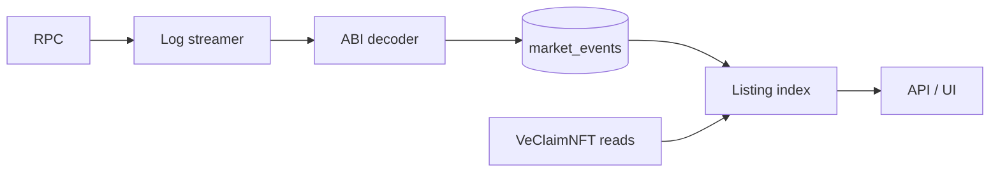

# Index Market listings

**Where this fits:** Furnace loop in the [CLAIM stream](../protocol-overview.md) · Contract: [MarketRouter](../marketrouter.md), [Events & Indexing](../events-and-indexing.md)

Goal:
- index Market listings for analytics or a custom UI
- compute listing-level metrics (minimum payout per ve, discount vs principal)

**Strict mode invariant:**
- The Furnace is the only counterparty for listing settlement.
- Listings are limit sells to the Furnace. There are no user-to-user lock transfers.

## What you will use

- `MarketRouter` address from `deployments/<network>.json`
- `abis/<network>/MarketRouter.abi.json`
- `VeClaimNFT` reads for principal/autoMax/lockEnd

## Data flow

## Steps

### 1) Decode the core Market events

Minimum set:
- `LockListed` (limit sell to Furnace created)
- `LockDelisted` (listing removed)
- `ListingSettled` (listing settled into the Furnace)

If you support Buy intents (limit buys / bonus target escrow into the Furnace):
- `BonusTargetEscrowCreated`
- `BonusTargetEscrowConfigured`
- `BonusTargetEscrowExecuted` (canonical generic execution receipt)
- `BonusTargetEscrowAutoFurnaceExecuted` (back-compat companion receipt)
- `BonusTargetEscrowCancelled`
- `BonusTargetEscrowExpired`
- `BonusTargetEscrowExpiryExtended`

Note:
- Bonus target escrow execution routes into the Furnace, not into buying user locks.
- `executeAutoFurnace` emits both execution receipts in the same tx; use the generic `BonusTargetEscrowExecuted` event for canonical accounting and keep the auto-furnace receipt for compatibility joins.
- If you also expose subgraph `bonusTargetEscrowEvents` as offer history, treat `kind = FILLED` as the canonical fill row and do not double-count the same-tx `AUTO_FURNACE_EXECUTED` companion row.

Sellback note:
- A seller can exit via **Sell now (Market sell)** to the Furnace.
- In that case you will see:
  - MarketRouter `MarketSellToFurnace` (always)
  - `LockDelisted(tokenId, seller, SOLD_TO_FURNACE)` if the lock was previously listed
  - Furnace `LockSoldToFurnace` (the lock is burned).
- The strict-mode router never emits `LockDelisted(tokenId, seller, APPROVAL_REVOKED)`. Reason code `5` is reserved for analytics compatibility only.

### 2) Maintain listing state

Your listing index can be:
- "event sourced" (derive current state from the event stream)
- or "state verified" (occasionally confirm with onchain views)

For most products:
- event sourced is enough and cheaper

Also index listing **expiry** (`expiresAtTime`) from `LockListed` so UIs can hide/disable expired listings and indexers can auto-mark them inactive.

### 3) Compute the 3 most useful listing metrics

Given a tokenId:
- **principal**: from `VeClaimNFT.getLockInfo(tokenId).amount`
- **veNow**: compute from the ve math (below)

Compute veNow:
- if `autoMax == true`: `veNow = amount`
- else: `veNow = floor(amount * (lockEnd - now) / MAX_LOCK_DURATION)`

Then:
- **minimum payout per ve** = `minClaimOut / veNow`
- **discount vs principal** = `(principal - minClaimOut) / principal`
  - 0 = par, positive = discount, negative = premium
- **time remaining** = `effectiveLockEnd - now`
  - if autoMax is ON, treat time remaining as `MAX_LOCK_DURATION`

**Watch out:** When `MarketRouter.tradingPaused == true`, new listings and settlements are blocked, but existing listings remain in state. Your indexer should mark them as "frozen" rather than removing them — they become settleable again once trading resumes.

### 4) Track settlements correctly

When a listing is settled by the Furnace:
- `ListingSettled` is emitted
- The lock is transferred to the Furnace and burned
- The seller receives CLAIM

For indexers:
- treat `ListingSettled` as the canonical "listing closed" moment for successful Furnace settlements
- treat `LockDelisted` reasons `NORMAL`, `EMERGENCY`, `SOLD_TO_FURNACE`, and `EXPIRED` as the live production delist set; codes `SOLD_INTO_OFFER` and `APPROVAL_REVOKED` are reserved and not emitted by the strict-mode router

## What success looks like

- You can render a listings page from your DB.
- "Listed/frozen" state matches `LockListed` / `LockDelisted` / `ListingSettled` event state plus `MarketRouter.tradingPaused()`.
- All settlements show as Furnace settlements (no user-to-user lock transfers).

## See also

- Protocol Market details: [Market (MarketRouter)](../marketrouter.md)
- ve math + autoMax rules: [Locks (veCLAIM)](../locks-veclaim.md)
