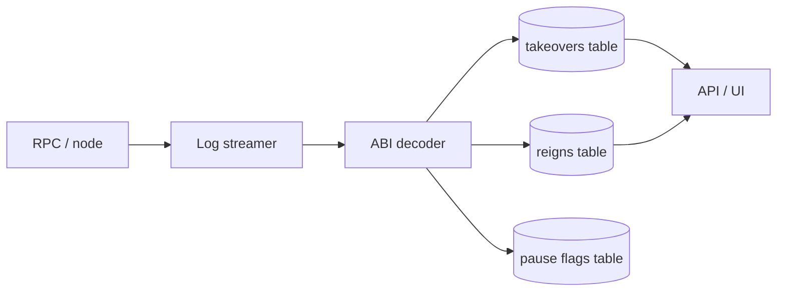

# Index takeovers and reigns

**Where this fits:** Crown loop in the [CLAIM stream](../protocol-overview.md) · Contract: [Core Mechanics](../core-mechanics.md), [Events & Indexing](../events-and-indexing.md)

Build a minimal indexer that:
- tracks Crown ownership over time (reigns)
- tracks takeovers (price paid, King payout routing, Barons allocation)

## What you will use

- `deployments/<network>.json` (addresses + start blocks)
- `abis/<network>/MineCore.abi.json` (event decoding)
- `src/lib/Events.sol` (canonical event signatures)

## Data flow (high level)



## Steps

### 1) Load addresses and start block from the manifest

- Pick a network key used by the repo:
  - `base_mainnet`
  - `base_sepolia`
  - `local`

Example (TypeScript-ish pseudocode):

```ts
import fs from "node:fs";

type Deployment = {
  chainId: number;
  startBlock: number;
  contracts: Record<string, { address: string }>;
};

const manifest: Deployment = JSON.parse(
  fs.readFileSync(`deployments/base_mainnet.json`, "utf8")
);

const startBlock = manifest.startBlock;
const mineCore = manifest.contracts["MineCore"].address;
```

### 2) Stream logs starting at `startBlock`

- Always start at the manifest startBlock (do not guess).
- Store your cursor (last processed block) so re-indexing is idempotent.

**Watch out:** Using a block number earlier than `startBlock` wastes RPC credits. Using one later silently drops events — your reign history will have gaps and totals will be wrong.

### 3) Decode the canonical MineCore events

Minimum useful set:
- `Takeover`
- `ReignFinalized`
- `TakeoversPausedChanged`

Implementation rules:
- Prefer the ABI JSON shipped in `abis/`.
- If you implement your own decoder, verify your signature list against `src/lib/Events.sol`.

### 4) Write two core tables

**takeovers** (1 row per takeover tx)
- blockNumber, txHash, logIndex
- reignId
- newKing, prevKing
- pricePaid (ETH)
- kingPayout (ETH) and whether it was pushed or credited (if emitted)
- baronsAllocation (ETH)

**reigns** (1 row per reign)
- reignId
- king
- startTs, endTs
- pricePaidToEnter (ETH)
- minedClaimAmount (if emitted or derivable)

If your tables come from multiple events:
- use `(txHash, logIndex)` as the stable event id
- derive reign boundaries from `ReignFinalized`

### 5) Add 2 integrity checks

- Chain continuity:
  - no gaps in processed blocks
- Determinism:
  - replaying the same range produces the same rows

## What success looks like

- You can render a reign history page from your DB only.
- You can compute “who is King now” by taking the latest takeover/reign state.
- You can compute total ETH routed to Barons by summing `baronsAllocation`.

## See also

- Pricing + emissions math: [Core mechanics](../core-mechanics.md)
- Canonical event schema: [Events and indexing](../events-and-indexing.md)
