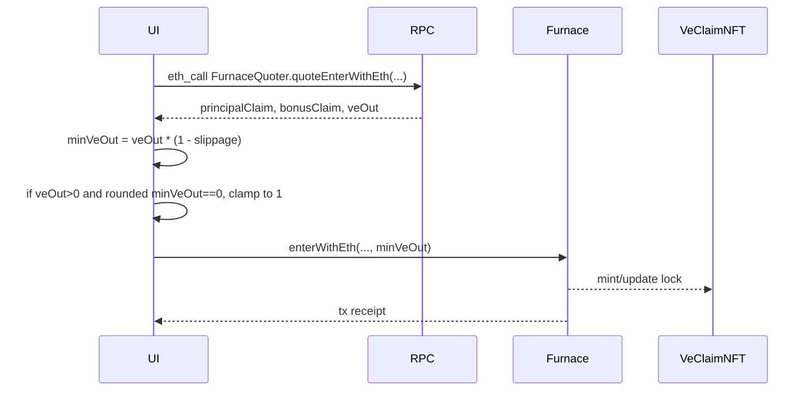
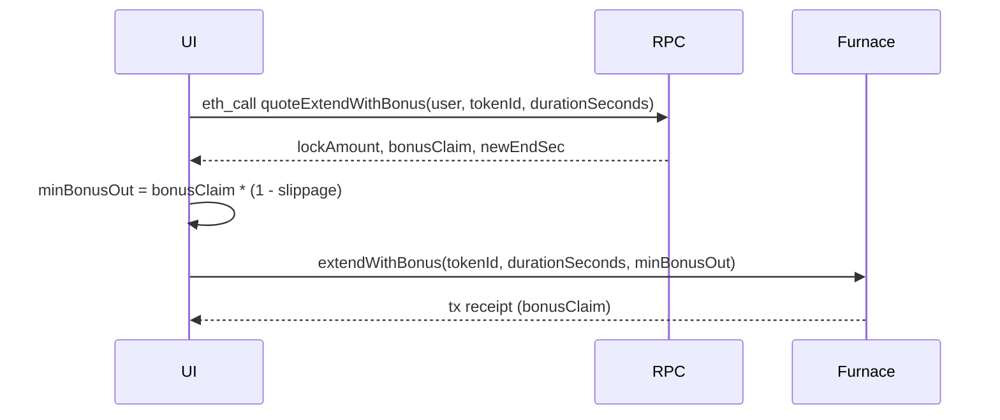

# Integrate Furnace quotes + enter

**Where this fits:** Furnace loop in the [CLAIM stream](../protocol-overview.md) · Contract: [Furnace](../furnace.md)

Goal:
- quote how much **veCLAIM** a user will receive for an entry
- execute a Furnace entry with a **minVeOut** slippage guard

Semantics (UI / docs alignment):
- This is **Buy now (Enter now / Market buy)**: the user enters the Furnace immediately using a live quote (mint/topup; not a user-to-user purchase).
- Mental model: “I'm willing to put **1000 CLAIM** or **1 ETH** into the Furnace. Tell me how much **ve** I'm getting in exchange.”
- Recommended user-facing labels:
  - **Input amount** (user budget): `tokenIn` + `amountIn`
  - **Estimated output now** (live quote): `estimatedVeOut` (and `principalClaim + bonusClaim`)
  - **Minimum output** (`minVeOut`) as the output slippage guard (derived from the quote)
  - on swap paths (input token ≠ CLAIM), the Furnace uses a protocol-set swap deadline: `block.timestamp + SWAP_DEADLINE_SECONDS` (currently **300s**)

Canonical field names (docs-wide):
- `tokenIn`, `amountIn`, `estimatedVeOut`, `slippageBps`, `minVeOut`


This tutorial covers:
- ETH entry (`enterWithEth`)
- CLAIM entry (`enterWithClaim`)
- optional token entry (`enterWithToken`) via `EntryTokenRegistry`

## Recommended UI defaults (entry token selection)

Entry token goal: prevent “I have ETH but no CLAIM” dead ends, while staying honest that the asset being locked is CLAIM.

Recommended default selection:
- If connected user has `CLAIM` balance > 0: default to CLAIM entry (`enterWithClaim`).
- Otherwise: default to ETH entry (`enterWithEth`).
- If the flow is launched from “Collect & Lock” (royalties): default to ETH and treat it as a compounding flow (no token selector).
- Remember the user’s last selection per wallet (override only for Collect & Lock entry).

Recommended preview labeling (trust requirement):
- Use **Pay with** (entry token) and **You lock** (always CLAIM).
- When entry token ≠ CLAIM, show an inline note: “Includes swap to CLAIM, then lock.”

## Flow



## Steps

### 1) Load addresses from the manifest

You need (at minimum):
- `Furnace` address
- `FurnaceQuoter` address (resolve from `Furnace.furnaceQuoter()`)
- `VeClaimNFT` address
- (optional) `EntryTokenRegistry` for Furnace entries

### 2) Quote first, always

Call the view helper on **FurnaceQuoter** (not Furnace) that matches the user’s input type:
- `FurnaceQuoter.quoteEnterWithEth(...)`
- `FurnaceQuoter.quoteEnterWithClaim(...)`
- `FurnaceQuoter.quoteEnterWithToken(...)`

Important:
- Quote views live exclusively on **FurnaceQuoter**. Resolve the address via `Furnace.furnaceQuoter()`.
- If `furnaceQuoter` is unset (or `lockingPaused == true`), quote calls revert.

**Watch out:** When `Furnace.lockingPaused == true`, both quotes and entries revert. Always check the pause flag before calling quote endpoints and surface a clear message in your UI ("Furnace entries are paused").

Each quote returns:
- principalClaim
- bonusClaim (net user bonus)
- veOut (expected entry-attributable ve delta for the newly locked amount at the lock's remaining duration)
- tokenIdUsed (4th return value; named `routeTokenId` in the ABI)
  - `0` = create a new lock
  - otherwise = route into an existing destination lock tokenId

Note: This `tokenIdUsed` is unrelated to EntryTokenRegistry `routeTokenId` (DIRECT_TO_CLAIM / VIA_WETH).

### 3) Compute `minVeOut`

Client pattern:
- `minVeOut = floor(veOutQuote * (10_000 - slippageBps) / 10_000)`
- Entry into an existing lock does not extend duration. `veOutQuote` reflects the newly locked amount at the existing remaining duration.
- If `veOutQuote > 0` but floor-rounding would produce `minVeOut == 0`, clamp to `1`.

Typical defaults:
- 50–100 bps for normal conditions

Important:
- `minVeOut` MUST be > 0. Furnace reverts with `MinVeOutRequired` when `minVeOut == 0`.
- On swap paths, the DexAdapter swap uses `amountOutMin = 0` at the router level.
  - slippage protection is enforced atomically by the downstream `minVeOut` check.

### 4) Execute the entry

ETH entry:
- call `enterWithEth(targetTokenId, durationSeconds, createAutoMax, minVeOut)`
- set `msg.value` to the user’s ETH amount

CLAIM entry:
- approve CLAIM to the Furnace
- call `enterWithClaim(claimAmount, targetTokenId, durationSeconds, createAutoMax, minVeOut)`

Token entry (optional):
- ensure token is enabled in the Furnace’s `EntryTokenRegistry`
- call `enterWithToken(tokenIn, amountIn, targetTokenId, durationSeconds, createAutoMax, minVeOut)`

### 5) Post-tx: refresh lock state

After confirmation:
- read the lock by tokenId (new or existing)
- update:
  - principal amount
  - lock end
  - autoMax
  - ve balance (if you show it)

## What success looks like

- Your quote matches `FurnaceQuoter` for the same inputs.
- Users can safely submit entries with a predictable `minVeOut` guard.

## Extension bonus (existing locks)

The Furnace also awards bonuses when extending an existing lock's duration. No new capital is required — the bonus is computed on the lock's existing principal for the incremental duration commitment.

### Quote extension bonus



View helper:
- `quoteExtendWithBonus(user, tokenId, durationSeconds)` -> `(lockAmount, bonusClaim, newEndSec)`

Returns:
- `lockAmount` — current CLAIM in the lock
- `bonusClaim` — estimated bonus from the extension
- `newEndSec` — new lock end timestamp

Rejects AutoMax locks — AutoMax locks receive bonuses automatically (use `quoteAutoMaxBonus` to preview).

### Execute extension

```solidity
extendWithBonus(tokenId, durationSeconds, minBonusOut)
```

- `durationSeconds` — target total remaining duration (clamped to [MIN, MAX])
- `minBonusOut` — minimum bonus CLAIM; reverts if not met (pass 0 to skip)

Derive `minBonusOut`:
- `minBonusOut = floor(bonusClaim * (10_000 - slippageBps) / 10_000)`

No approval needed — the lock already exists and no new CLAIM is transferred from the user.

### AutoMax automatic bonus growth (keeper pattern)

AutoMax locks receive extension bonuses automatically — a key advantage of choosing AutoMax. A separate permissionless function handles this:

- `claimAutoMaxBonus(tokenId)` — any caller can trigger, 24h onchain cooldown per lock; official keeper triggers per settlement period per owner (daily by default)

This is a keeper/bot task, not a user-facing flow. See [Maintenance and Bots](../maintenance-and-bots.md) for integration.

Quote: `quoteAutoMaxBonus(tokenId)` -> `(lockAmount, bonusClaim)`

## See also

- Bonus model + constants: [Furnace](../furnace.md)
- Token allowlisting and routing: [EntryTokenRegistry and DexAdapter](../entrytokenregistry-and-dexadapter.md)
