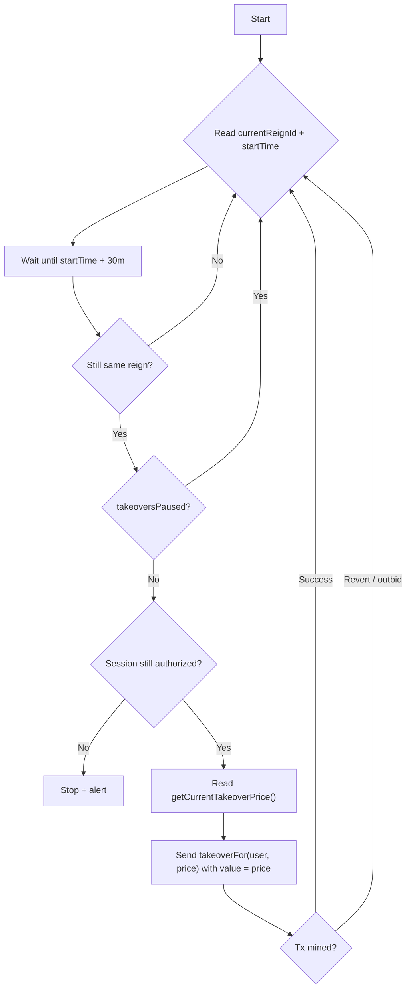

# Run a Crown bot (takeover at 30 minutes)

**Where this fits:** Crown loop in the [CLAIM stream](../protocol-overview.md) · Contracts: [Core Mechanics](../core-mechanics.md), [DelegationHub](../delegationhub.md)

This tutorial shows an example of an opt-in bot that:
- waits until the reign timer reaches **30 minutes**
- calls `MineCore.takeoverFor(user, maxPrice)`
- pays ETH from the bot wallet

Preconditions:
- The user has created a **Bot session** (DelegationHub) authorizing your bot.
- You have a funded bot key (hot wallet) on Base.

Important auth note:
- The raw `MineCore.delegationHub()` + `DelegationHub.isAuthorized(...)` preflight below is advisory only.
- `MineCore.takeoverFor(...)` resolves the canonical hub through the live Furnace + MineCore bundle and can still revert on wiring drift even if the raw stored hub says the session is authorized.

## Flow



## Permissions

Minimum required session:
- `P_TAKEOVER_FOR`

Optional quality-of-life permissions:
- `P_SET_REIGN_ETH_RECIPIENT` or `P_SET_REIGN_ETH_RECIPIENT_TO_CALLER_ONLY` (if your bot will update ETH routing mid-reign)
- `P_SET_REIGN_CLAIM_RECIPIENT` or `P_SET_REIGN_CLAIM_RECIPIENT_TO_USER_ONLY` (if your bot will update CLAIM routing mid-reign)
- `P_ROUTE_REIGN_CLAIM_TO_CALLER` (only if the user wants mined CLAIM sent to the bot)

See full map: [Bot sessions (DelegationHub)](../delegationhub.md)

**Watch out:** If the bot fires two `takeoverFor` calls in rapid succession (e.g. after a revert-and-retry), the second may land in the same block while the price has doubled from the first. Always re-read `getCurrentTakeoverPrice()` and confirm the reign ID before retrying.

## Routing defaults (important)

For delegated takeover:
- **King identity** becomes the user address.
- By default:
  - the bot receives the dethroned-King **75% ETH payout** (to support looping)
  - mined King-stream **CLAIM stays with the user**

## Example bot (Node + viem)

This is a minimal polling loop (not a production keeper).

### Env

```bash
export RPC_URL="https://..."
export BOT_PRIVATE_KEY="0x..." # pragma: allowlist secret
export MINECORE="0x..."
export USER="0x..."                 # newKing identity
export MIN_REIGN_AGE_SECONDS="1800" # optional, default 1800 (=30m)
```

### Script

```js
import { createPublicClient, createWalletClient, http } from "viem";
import { privateKeyToAccount } from "viem/accounts";
import { base } from "viem/chains";

const mineCoreAbi = [
  {
    type: "function",
    name: "currentReignId",
    stateMutability: "view",
    inputs: [],
    outputs: [{ type: "uint256" }]
  },
  {
    type: "function",
    name: "currentReignStartTime",
    stateMutability: "view",
    inputs: [],
    outputs: [{ type: "uint256" }]
  },
  {
    type: "function",
    name: "takeoversPaused",
    stateMutability: "view",
    inputs: [],
    outputs: [{ type: "bool" }]
  },
  {
    type: "function",
    name: "getCurrentTakeoverPrice",
    stateMutability: "view",
    inputs: [],
    outputs: [{ type: "uint256" }]
  },
  {
    type: "function",
    name: "delegationHub",
    stateMutability: "view",
    inputs: [],
    outputs: [{ type: "address" }]
  },
  {
    type: "function",
    name: "takeoverFor",
    stateMutability: "payable",
    inputs: [
      { name: "newKing", type: "address" },
      { name: "maxPrice", type: "uint256" }
    ],
    outputs: []
  }
];

const delegationHubAbi = [
  {
    type: "function",
    name: "isAuthorized",
    stateMutability: "view",
    inputs: [
      { name: "user", type: "address" },
      { name: "delegate", type: "address" },
      { name: "requiredPerms", type: "uint256" }
    ],
    outputs: [{ type: "bool" }]
  }
];

// DelegationPermissions.P_TAKEOVER_FOR = 1 << 0
const P_TAKEOVER_FOR = 1n << 0n;

const sleep = (ms) => new Promise((r) => setTimeout(r, ms));

async function main() {
  const rpcUrl = process.env.RPC_URL;
  const mineCore = process.env.MINECORE;
  const user = process.env.USER;
  if (!rpcUrl || !mineCore || !user) throw new Error("Missing RPC_URL/MINECORE/USER");

  const account = privateKeyToAccount(process.env.BOT_PRIVATE_KEY);

  const publicClient = createPublicClient({ chain: base, transport: http(rpcUrl) });
  const walletClient = createWalletClient({ chain: base, transport: http(rpcUrl), account });

  // Advisory preflight only. takeoverFor(...) re-resolves canonical auth onchain.
  const delegationHub = await publicClient.readContract({
    address: mineCore,
    abi: mineCoreAbi,
    functionName: "delegationHub"
  });

  const isAuth = await publicClient.readContract({
    address: delegationHub,
    abi: delegationHubAbi,
    functionName: "isAuthorized",
    args: [user, account.address, P_TAKEOVER_FOR]
  });

  if (!isAuth) {
    throw new Error(`Not authorized: user ${user} has not delegated P_TAKEOVER_FOR to ${account.address}`);
  }

  const minReignAgeSeconds = BigInt(process.env.MIN_REIGN_AGE_SECONDS || "1800");

  let lastAttemptedReign = 0n;

  while (true) {
    const paused = await publicClient.readContract({
      address: mineCore,
      abi: mineCoreAbi,
      functionName: "takeoversPaused"
    });

    if (paused) {
      await sleep(15_000);
      continue;
    }

    const reignId = await publicClient.readContract({
      address: mineCore,
      abi: mineCoreAbi,
      functionName: "currentReignId"
    });

    const startTime = await publicClient.readContract({
      address: mineCore,
      abi: mineCoreAbi,
      functionName: "currentReignStartTime"
    });

    const now = BigInt(Math.floor(Date.now() / 1000));
    const target = startTime + minReignAgeSeconds;

    // Wake up frequently so we don't sleep past a takeover that resets the timer.
    if (now < target) {
      const ms = Number((target - now) * 1000n);
      await sleep(Math.min(ms, 30_000));
      continue;
    }

    if (reignId == lastAttemptedReign) {
      await sleep(10_000);
      continue;
    }

    // Read price right before sending.
    const price = await publicClient.readContract({
      address: mineCore,
      abi: mineCoreAbi,
      functionName: "getCurrentTakeoverPrice"
    });

    // Send the quoted price as both the tx value and the maxPrice guard.
    // If someone takes over first, the cost doubles and this tx reverts (PriceExceeded).
    // If the cost decays further before execution, any excess is refunded/credited.
    const value = price;

    try {
      const hash = await walletClient.writeContract({
        address: mineCore,
        abi: mineCoreAbi,
        functionName: "takeoverFor",
        args: [user, price],
        value
      });

      await publicClient.waitForTransactionReceipt({ hash });
      lastAttemptedReign = reignId;
    } catch (err) {
      // Most common reasons:
      // - someone else took over first (state changed)
      // - tx stayed pending too long
      // - transient RPC issue
      // - bot ran out of ETH
      console.error("takeoverFor failed", err?.shortMessage || err?.message || err);
      await sleep(5_000);
    }
  }
}

main().catch((e) => {
  console.error(e);
  process.exit(1);
});
```

## What success looks like

- The bot reliably submits takeovers close to the 30 minute mark.
- Reverts happen occasionally (competition), but the bot recovers on the next loop.
- The user becomes King, but the bot receives the dethroned payout by default.

## See also

- Permission model: [Bot sessions (DelegationHub)](../delegationhub.md)
- Crown mechanics: [Core mechanics](../core-mechanics.md)
- Pause rules: [Security, guardian, pausing](../security-guardian-pausing.md)
