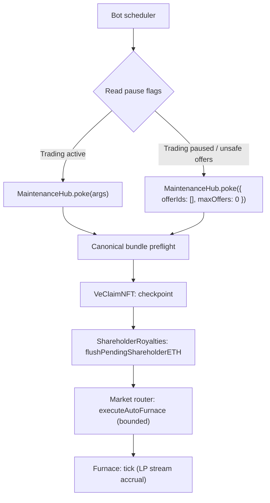

# Run a MaintenanceHub bot (poke loop)

**Where this fits:** Protocol upkeep · Contract: [Maintenance & Bots](../maintenance-and-bots.md)

Goal:
- run permissionless upkeep safely and predictably
- keep checkpoints, reward flushes, and marketplace automation moving

MaintenanceHub is designed so **once its canonical wiring preflight passes, poke does not revert due to a single subcall failure**.

## Flow

## Steps

### 1) Load contract addresses from the manifest

You need:
- `MaintenanceHub`
- `MarketRouter`
- `VeClaimNFT`
- `ShareholderRoyalties`

**Note:** after `poke(args)` passes its canonical-bundle preflight, individual subcall errors are swallowed. If the immutable hub is stale or split-brain, `poke(args)` reverts before any sub-action so your bot can surface the wiring issue instead of silently maintaining the wrong bundle.

### 2) Read pause flags before you call

At minimum:
- `MineCore.takeoversPaused()`
- `Furnace.lockingPaused()`
- `MarketRouter.tradingPaused()`

Policy:
- If trading is paused, do not include offerIds for auto-Furnace execution, but keep calling `poke({ offerIds: [], maxOffers: 0 })` for checkpoint/flush/tick upkeep.
- If locking is paused, treat any slippage-dependent swaps as unsafe.
- If `poke(args)` starts reverting with `WiringMismatch`, stop the loop, fix or redeploy the stale `MaintenanceHub`, and refresh your manifest before resuming.

### 3) Construct `PokeArgs`

Shape (ABI order matters):
- `offerIds: uint256[]`
- `maxOffers: uint256` (clamped onchain)

Practical defaults:
- `maxOffers`: 10–25

### 4) Run on a fixed cadence

Typical patterns:
- every 1–5 minutes
- or event-driven (new offerIds appended, then poke)

### 5) Observe outcomes via events

Index:
- `MaintenanceHub.Poked` — carries `checkpointOk`, `flushOk`, and `furnaceTickSucceeded` boolean flags reporting whether each sub-action landed cleanly. The full event signature lives in [Events and Indexing](../events-and-indexing.md).
- downstream events (Market router auto-Furnace executed, flush, tick, etc)

Cursor-gating rule for keepers tracking per-poke state across runs:

- Advance the takeover-reign and pending-shareholder-ETH cursors only when `flushOk == true`. A `flushOk == false` tick means `flushPendingShareholderETH` was deferred (the ve checkpoint had not caught up to `block.timestamp`, the processed ve total fell below `MIN_VE_FLUSH`, or reward-checkpoint storage could not safely represent the new flush timestamp). The pending ETH stays in `ShareholderRoyalties.pendingShareholderETH`; the keeper retries on the next tick.
- Advance the LP tick cursor only when `furnaceTickSucceeded == true`. A `furnaceTickSucceeded == false` tick means the LP stream accrual sub-call swallowed a revert; the schedule is unchanged and the keeper retries on the next tick.
- Advance the ve-checkpoint cursor only when `checkpointOk == true`. A `checkpointOk == false` tick means `VeClaimNFT.checkpointTotalVe` swallowed a revert; the keeper retries on the next tick.

The flags exist so the swallowed-revert hardening on `poke(args)` does not silently move the keeper's local watermark past unprocessed work. Treat each flag as the canonical signal that the corresponding sub-action committed.

## What success looks like

- poke calls succeed consistently and gas stays stable.
- Your bot drops unsafe offer sweeps during pauses but keeps non-market upkeep moving.

## See also

- Full surface: [Maintenance and bots](../maintenance-and-bots.md)
- Pause rules: [Security, guardian, pausing](../security-guardian-pausing.md)
