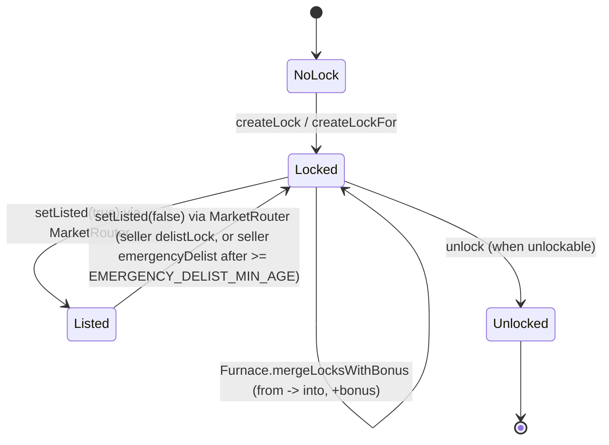
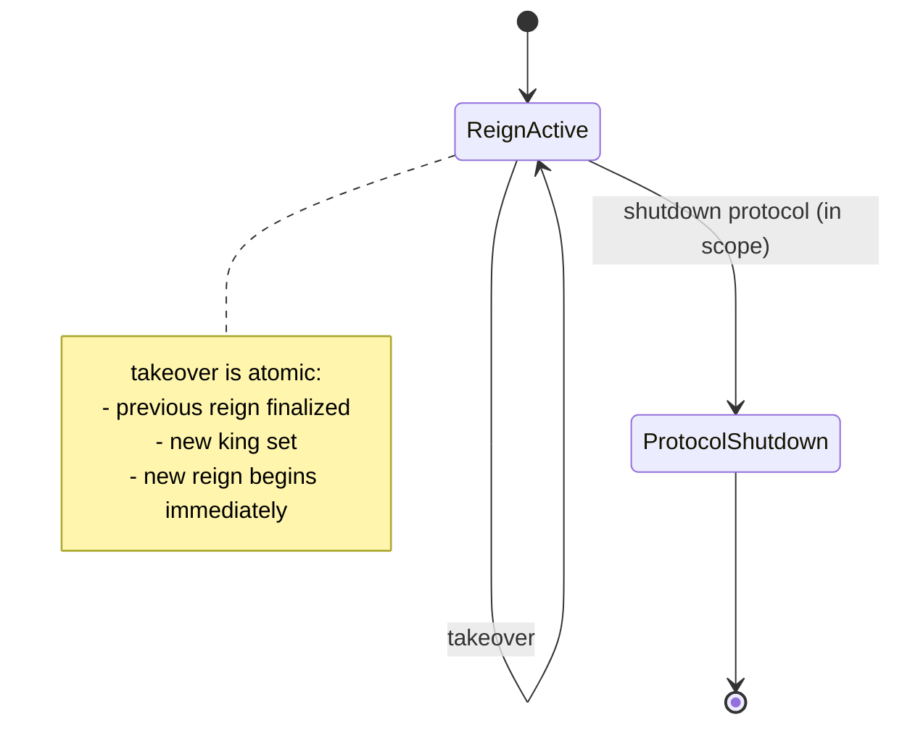
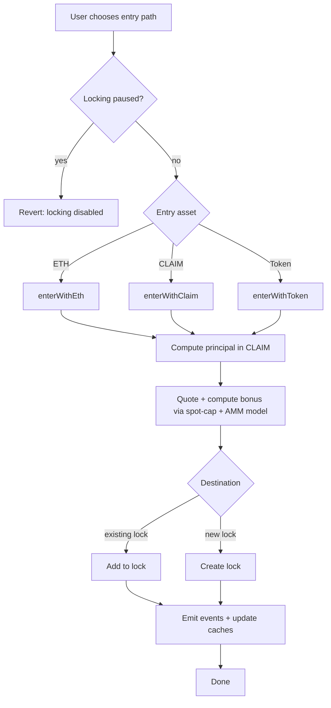
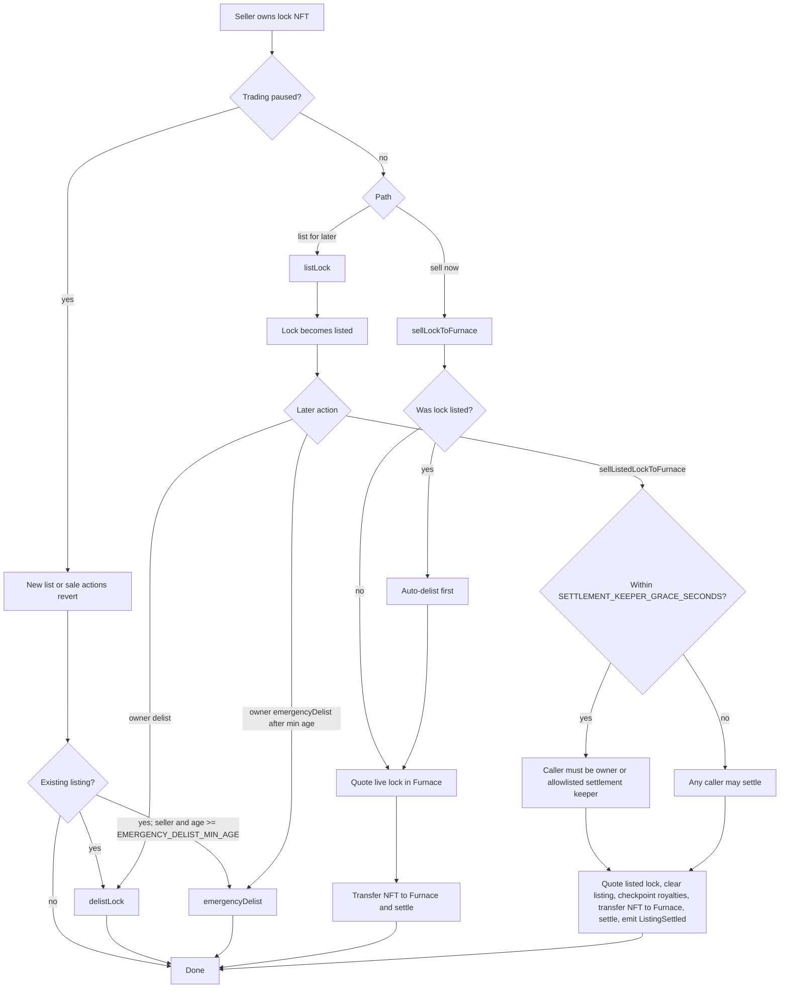

# docs/spec/state-machines-v1.0.0.md

This file provides **diagrammatic views** of the core ClaimRush v1.0.0 flows.

Clarification (non-binding):
- These diagrams are an aid for implementers and reviewers.
- The authoritative behavior remains in:
  - `docs/spec/spec-v1.0.0.md`
  - `src/lib/Constants.sol`
  - [Math and rounding appendix](../architecture/math-and-rounding-appendix-v1.0.0.md)

---

## VeClaimNFT lock lifecycle

Preconditions:
- `createLock` / `createLockFor` require `amount >= MIN_LOCK_AMOUNT` (1,000 CLAIM) and duration within `[MIN_LOCK_DURATION, MAX_LOCK_DURATION]`.



---

## MineCore reign lifecycle (king / takeover)



---

## Protocol shutdown flow (in scope, exit-only mode)

Shutdown is an operator-driven safety action that moves the protocol into **exit-only mode**.

In v1.0.0 this is implemented by combining existing pause and routing-disable surfaces (no new onchain "shutdown" flag).

```mermaid
flowchart TD
  A[Shutdown protocol] --> B[MineCore.setTakeoversPaused(true)]
  B --> C[MineCore.setLockingPaused(true)]
  C --> D[MarketRouter.pauseTrading(true)]
  D --> E{Routing unsafe?}
  E -->|yes| F[EntryTokenRegistry: disable affected tokens\n(optional: disable all non-ETH entry)]
  E -->|no| G[Skip]
  F --> H[Stop keeper jobs that submit swaps or market sweeps\n(MaintenanceHub poke with offerIds, auto-Furnace, compounding)]
  G --> H
  H --> Z[Shutdown mode:\nexit/unwind only]
```

Exit/unwind/housekeeping calls that MUST remain available in shutdown mode:

- MineCore:
  - `withdrawKingBalance()`
  - refund withdrawals (hybrid refund bucket, REQUIRED)
- ShareholderRoyalties:
  - `claimShareholder(ETH, ...)` (LOCK_FURNACE mode will be blocked when locking is paused)
- MarketRouter (when `tradingPaused == true`):
  - `delistLock(...)` (MUST remain callable as an unwind path)
  - `cancelExpiredListing(...)` (MUST remain callable as a permissionless stale-listing cleanup path)
  - `cancelBonusTargetEscrow(...)` (MUST remain callable as an unwind path)
  - `cancelExpiredBonusTargetEscrow(...)` (MUST remain callable as a permissionless expired-offer cleanup path)
  - `emergencyDelist(...)` (MUST remain callable; seller-only)
  - Note: `extendBonusTargetEscrowExpiry(...)` also reverts when paused (`whenTradingEnabled`).
- VeClaimNFT:
  - `unlock(...)` for eligible, unlisted locks

Operational note:
- When `tradingPaused == true`, `MaintenanceHub.poke(...)` can still be used for non-market upkeep by passing `offerIds=[]` (or `maxOffers=0`). That preserves ve checkpoints, shareholder ETH flushing, and Furnace ticking while skipping `MarketRouter.executeAutoFurnace(...)`.

Clarification (non-binding):
- See also: operational security runbook → "Guardian playbooks (pause and unpause)".
- See also: monitoring and incident response documentation → "Incident response playbook".

---

## MineCore takeover (atomic sequence, detail)

This is a diagram of the deterministic takeover sequence from `docs/spec/spec-v1.0.0.md` §5.4.2.

```mermaid
flowchart TD
  A[Takeover entrypoint] --> B{takeoversPaused?}
  B -->|yes| R[Revert]
  B -->|no| C[Compute price = getCurrentTakeoverPrice()]
  C --> D{Entry path}
  D -->|"takeover(maxPrice)"| E[Require msg.value >= price\npricePaid = price\nrefundEth = msg.value - price]
  D -->|takeoverWithToken(...)| F[Token entry: if tokenIn == WETH, unwrap -> ETH else swap token->WETH->ETH\nrequire ethOut >= minEthOut\nrequire ethOut >= price\npricePaid = price\nrefundEth = ethOut - price]
  E --> G
  F --> G
  G[Checkpoint ve global state\ncheckpointGlobalState] --> H[Accrue emissions since last accrual cursor\n(exclude paused time)]
  H --> I{prevKing exists?}
  I -->|no (genesis reign)| J[shareholderShare = pricePaid\nShareholderRoyalties.onTakeover(0)\nflushPendingShareholderETH()]
  I -->|yes| K[Split ETH:\nkingShare=75%\nshareholderShare=25%]
  K --> L[Best-effort pay prevKing
fallback: kingEthBalance[prevKing] += kingShare]
  L --> M[ShareholderRoyalties.onTakeover(prevReignId)\nflushPendingShareholderETH()]
  M --> N[Emit ReignFinalized(prevReignId, prevKing, ...)]
  J --> O[Start new reign:\nreignId++\ncurrentKing = msg.sender\nreferencePrice = pricePaid * 2\nset accrual cursor = now]
  N --> O
  O --> P[Emit Takeover(reignId, prevKing, newKing, pricePaid, referencePrice, now)]
  P --> Q[Attempt refund to caller\nfallback: refundEthBalance[caller] += refundEth]
  Q --> Z[Done]
```

Constraints (required):
- `flushPendingShareholderETH()` is safe to call even if the processed denominator is zero, if the processed denominator rounds below `MIN_VE_FLUSH`, or if `globalLastTs()` is still stale after bounded checkpointing (all are no-op paths for residual pending ETH).
- For non-zero takeover ETH or non-zero pending ETH, `onTakeover(...)`, `addPendingShareholderETH(...)`, and `flushPendingShareholderETH()` MUST fail closed unless the live `Furnace / MarketRouter / MineCore / VeClaimNFT / ClaimToken` bundle still resolves to this exact `ShareholderRoyalties` root.
- `onTakeover(reignId)` immediately attempts shareholder indexing whenever a processed denominator exists, even below `MIN_VE_FLUSH`, but the attempt still defers if `globalLastTs()` is not yet current.
- Refund failure MUST NOT revert takeover (hybrid refund bucket).

---

## ShareholderRoyalties flush flow

```mermaid
flowchart TD
  A[flushPendingShareholderETH()] --> B{pendingShareholderETH == 0?}
  B -->|yes| Z[return]
  B -->|no| C[ve.checkpointTotalVe()]
  C --> D{ve.globalLastTs() != block.timestamp?}
  D -->|yes| Z1[return; defer until ve checkpoint catches up]
  D -->|no| E{totalWeight == 0\nor ceil(totalWeight / 1e18) < MIN_VE_FLUSH?}
  E -->|yes| Z
  E -->|no| F[delta = floor(pending * SHAREHOLDER_ACC / totalWeight)]
  F --> G{delta == 0?}
  G -->|yes| Z2[return; keep pending unchanged]
  G -->|no| H[ethPerVe += delta]
  H --> I[distributed = floor(delta * totalWeight / SHAREHOLDER_ACC)]
  I --> J[pendingShareholderETH -= distributed\n(dust remains pending)]
  J --> Y[done]
```

---

## ShareholderRoyalties claim flow

```mermaid
flowchart TD
  A[claimShareholder(mode,...)] --> B[checkpointUser(msg.sender)]
  B --> C[amount = claimableEth[msg.sender]]
  C --> D{amount == 0?}
  D -->|yes| Z[return]
  D -->|no| E[claimableEth[msg.sender] = 0]
  E --> F{mode}
  F -->|ETH| G[send ETH to msg.sender\n(revert on failure)]
  F -->|LOCK_FURNACE| H[call Furnace.lockEthReward{value: amount}(...)\n(bubble reverts)]
```


## Furnace entry flow (high level)



---

## MarketRouter lock sale flow (high level)



Constraints (required):
- `emergencyDelist` is seller-only, requires listing age >= `EMERGENCY_DELIST_MIN_AGE` (7 days), and MUST remain callable even when `tradingPaused == true`.
- When `tradingPaused == true`, `listLock`, `sellLockToFurnace`, `sellListedLockToFurnace`, `createBonusTargetEscrowWithTarget`, `extendBonusTargetEscrowExpiry`, and `executeAutoFurnace` revert; `delistLock`, `cancelExpiredListing`, `cancelBonusTargetEscrow`, `cancelExpiredBonusTargetEscrow`, and `emergencyDelist` remain callable to unwind or clean up positions. See `docs/spec/spec-v1.0.0.md` §8.2.
- `sellLockToFurnace` auto-delists a listed lock before routing it into Furnace settlement.
- Strict-mode `sellListedLockToFurnace` has no approval-revoked self-clear branch. Compatibility reason code `APPROVAL_REVOKED` remains reserved for analytics compatibility but is not emitted.

---

## LaunchController genesis finalization (one-shot)

This is the high-level `finalizeGenesis()` flow from `docs/spec/launch-controller-spec-v1.0.0.md`.

```mermaid
flowchart TD
  A[finalizeGenesis() entry] --> B{genesisFinalized?}
  B -->|yes| R[Revert]
  B -->|no| C{msg.value == 50 ether?}
  C -->|no| R
  C -->|yes| D{now >= T0 + 10d?}
  D -->|no| R
  D -->|yes| E{MineCore.takeoversPaused == true?}
  E -->|no| R
  E -->|yes| F[Pre-seed guard:\nif pool exists require totalSupply == 0]
  F --> G[CEI: genesisFinalized = true]
  G --> H[MineCore.collectGenesisKingClaim(to = LaunchController)\ncanonical LaunchController-like guardian only; EOA or foreign contract guardian rejected]
  H --> K[Resolve/create Aerodrome WETH/CLAIM volatile pool]
  K --> L[Transfer genesis CLAIM bucket only + wrap 50 ETH into WETH + transfer WETH into pool]
  L --> M[Mint LP directly to GenesisLPVault24M]
  M --> N[GenesisLPVault24M.startLock()]
  N --> O[MineCore.setTakeoversPaused(false)]
  O --> P[Emit GenesisFinalized(...)]
  P --> Z[Done]
```

Note:
- The genesis liquidity leg uses only the `CLAIM` minted by `MineCore.collectGenesisKingClaim(...)` in that same transaction. Donated / pre-existing controller `CLAIM` is excluded from the canonical seed and swept to `guardian` during finalization.

---

## MaintenanceHub poke flow (best-effort bundler)

```mermaid
flowchart TD
  A[poke(args) entry] --> A0[Preflight:
fail closed unless MarketRouter/Furnace/Ve/Royalties/MineCore/CLAIM still form one canonical bundle]
  A0 --> B[Bound work:
offersN=min(len(offers), min(maxOffers, MAX_MAINTENANCE_OFFERS_PER_CALL))]
  B --> C[Record wethBefore = WETH.balanceOf(this)]
  C --> D[Try/catch VeClaimNFT checkpoints]
  D --> E[Try/catch ShareholderRoyalties.flushPendingShareholderETH]
  E --> F[Try/catch MarketRouter.executeAutoFurnace on offers[0..offersN)]
  F --> G[Try/catch Furnace.tick]
  G --> H[Forward WETH bounty:
wethDelta = WETH.balanceOf(this) - wethBefore
if >0 transfer to msg.sender]
  H --> I[Emit Poked(...)]
  I --> Z[Done]
```

Note:
- `MaintenanceHub.poke(...)` intentionally flushes pending shareholder ETH before creating any new auto-Furnace entries, so older pending ETH is indexed against the pre-entry shareholder set.
- `MaintenanceHub.poke(...)` intentionally excludes `LpStakingVault7D.harvestFeesToRewards(...)` and both auto-compound executors. Those paths run as separate keeper tasks or owner/keeper allowlisted operations.
- Best-effort semantics apply only after the canonical-bundle preflight succeeds. If the immutable hub is stale or split-brain, `poke(...)` reverts before any sub-action.

---

## ClaimAllHelper claimAll flow

```mermaid
flowchart TD
  A[claimAll(...) entry] --> B[ShareholderRoyalties.claimShareholderFor(user, ...)]
  B --> C[MineCore.withdrawKingBalanceFor(user)]
  C --> Z[Done]
```

---

## EntryTokenRegistry route resolution

These are read-only resolution flows from `docs/spec/entry-token-registry-v1.0.0.md`.

### resolveFurnaceRoute(tokenIn) (direct vs via WETH)

```mermaid
flowchart TD
  A[resolveFurnaceRoute(tokenIn)] --> B{TokenConfig.enabled?}
  B -->|no| R[Revert: tokenIn not enabled]
  B -->|yes| S{Furnace exact-receipt safe?}
  S -->|no| RU[Revert: UnsafeEntryToken]
  S -->|yes| C{directToClaimEnabled?}
  C -->|yes| D[Return 1 hop:\ntokenIn -> CLAIM\nrouteTokenId = 0]
  C -->|no| E{WETH/CLAIM hop configured?}
  E -->|no| R2[Revert: WETH/CLAIM hop unset]
  E -->|yes| F[Return 2 hops:\ntokenIn -> WETH\nWETH -> CLAIM\nrouteTokenId = 1]
```

### resolveTakeoverRoute(tokenIn) (always token -> WETH)

```mermaid
flowchart TD
  A[resolveTakeoverRoute(tokenIn)] --> B{TokenConfig.enabled?}
  B -->|no| R[Revert: tokenIn not enabled]
  B -->|yes| C[Return 1 hop:\ntokenIn -> WETH]
```

> Note: `wrappedNative` (WETH) is never enabled as `tokenIn` in the registry. When `tokenIn == wrappedNative`, MineCore/Furnace bypass these resolution flows and treat WETH as a 1:1 unwrap to ETH.
