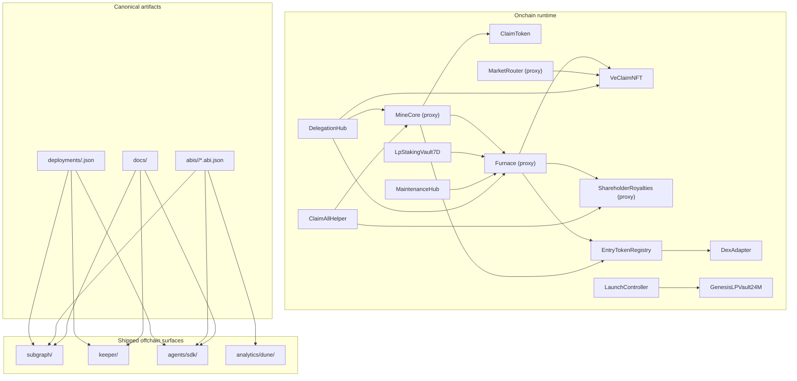

# ClaimRush v1.0.0 canonical index

Canonical documentation entrypoint: `docs/v1.0.0-index.md`.

Use this file to:
- orient implementers
- resolve doc conflicts deterministically
- navigate the published v1.0.0 spec set

> This index covers the public v1.0.0 protocol documentation shipped in this repo.

## Document signals

| Signal | Meaning |
|--------|---------|
| Canonical | Source of truth for shipped behavior, release data, or conflict resolution. |
| Reference | Explanatory or navigational material for the shipped surface. |
| Operator | Deployment, runtime, validation, or maintenance surface. |

## Entry matrix

| Intent | First files |
|--------|-------------|
| Audit | [Repo Map](manuals/developer/repo-map.md) [Reference], [Architecture reference](architecture/architecture-reference-v1.0.0.md) [Reference], [Protocol spec](spec/spec-v1.0.0.md) [Canonical], [Deployment manifests index](deployments/README.md) [Canonical] |
| Integrate | [Getting started](manuals/developer/getting-started.md) [Reference], [Protocol overview](manuals/developer/protocol-overview.md) [Reference], [Core mechanics](manuals/developer/core-mechanics.md) [Reference], [Furnace](manuals/developer/furnace.md) [Reference] |
| Run locally | [Getting started](manuals/developer/getting-started.md) [Reference], [`README.md`](../README.md) [Reference], [`Makefile`](../Makefile) [Operator], [`script/DeployLocal.s.sol`](../script/DeployLocal.s.sol) [Operator] |
| Index analytics | [Dune integration pack](analytics/dune-integration-pack-v1.0.0.md) [Canonical], [Subgraph schema](analytics/subgraph-schema-v1.0.0.md) [Canonical], [Indexer and Dune implementation guide](analytics/indexer-and-dune-implementation-guide-v1.0.0.md) [Reference], [`subgraph/README.md`](../subgraph/README.md) [Reference] |
| Operate runtime | [Runtime proxy upgrades](manuals/developer/runtime-proxy-upgrades.md) [Operator], [Genesis](manuals/developer/genesis.md) [Operator], [Freeze-and-burn finality](manuals/developer/freeze-and-burn-finality.md) [Operator], [Security and guardian pausing](manuals/developer/security-guardian-pausing.md) [Canonical] |

## System map

## Repository validation

Run this from repo root:
- `make gates`

`make gates` validates v1.0.0 repo consistency. It checks:
- Deployment artifact sync: `scripts/sync_deployments_all.sh --check`
- Deployment manifest schema parity across networks
- ABI sanity (valid JSON ABI arrays, no duplicate event signatures)
- ABI parity vs the canonical Dune event schema ([Dune integration pack](analytics/dune-integration-pack-v1.0.0.md))
- Analytics SQL lint (`analytics/scripts/lint_sql.sh`)
- Subgraph manifest/deployments sync across local/default/staging/prod manifests
- Subgraph mutable wiring semantics, codegen/build layout, schema/docs parity, derived event-kind parity, and manifest entity completeness

If `make gates` fails, generated artifacts, manifests, or reference docs are out of sync with the published repo state.

## Source of truth rules (if anything conflicts)

### Rule 1: numbers and constants
When a numeric constant differs, **the contract-specific spec wins**, in this order:
1) [Launch controller spec](spec/launch-controller-spec-v1.0.0.md)
2) [Entry token registry](spec/entry-token-registry-v1.0.0.md)
3) [Vault spec](spec/vault-spec.md)
4) [LP staking vault spec](spec/lp-staking-vault-spec.md)
5) [Maintenance hub spec](spec/maintenance-hub-spec-v1.0.0.md)
6) [Protocol spec](spec/spec-v1.0.0.md)

### Rule 2: function signatures and events
When a function signature or event differs, **the contract-specific spec wins** (same order as above).

When ambiguity remains:
- [Dune integration pack](analytics/dune-integration-pack-v1.0.0.md) is the canonical event schema + enum codebook used by analytics
- `src/lib/Events.sol` MUST mirror the event names/signatures in the Dune integration pack

### Rule 3: upgradeability profile (v1.0.0)

- v1.0.0 profile: **Non-upgradeable DexAdapter (no proxy upgrades)**.
  - DexAdapter is deployed directly (no proxy).
  - DEX/router changes ship via **redeploying DexAdapter** and **calling `EntryTokenRegistry.setRouterConfig(...)` through the live owner() path (typically timelocked in production)**.
    - Once the WETH/CLAIM hop or any token config exists, router/factory changes require a fresh registry deployment instead of in-place rewiring.
  - Exported DexAdapter ABIs MUST NOT include any UUPS upgrade functions.
- `ClaimToken` and `VeClaimNFT` are direct permanent roots.
- `MineCore`, `Furnace`, `MarketRouter`, and `ShareholderRoyalties` are transparent-proxy-backed runtime contracts.
  - Their canonical user/integration addresses are the proxy addresses recorded in manifests.
  - Code upgrades happen through owned `ProxyAdmin` contracts, not through UUPS entrypoints on the runtime contracts themselves.
  - `freezeConfig()` locks documented wiring setters but does not disable proxy-admin upgrades by itself.
  - Permanent runtime immutability arrives only after the freeze-and-burn ceremony renounces ownership on the four runtime `ProxyAdmin`s.

## Read order by role

### Audit / review
1) [Repo map](manuals/developer/repo-map.md) [Reference]
2) [Architecture reference](architecture/architecture-reference-v1.0.0.md) [Reference]
3) [Protocol spec](spec/spec-v1.0.0.md) [Canonical]
4) [Deployment manifests index](deployments/README.md) [Canonical]
5) [Dune integration pack](analytics/dune-integration-pack-v1.0.0.md) [Canonical]

### Contract implementer (onchain)
1) [Protocol spec](spec/spec-v1.0.0.md)
2) Implementer checklists:
   - [ClaimToken](spec/claimtoken-implementer-checklist-v1.0.0.md)
   - [MineCore](spec/minecore-implementer-checklist-v1.0.0.md)
   - [VeClaimNFT](spec/veclaimnft-implementer-checklist-v1.0.0.md)
   - [Furnace](spec/furnace-implementer-checklist-v1.0.0.md)
   - [MarketRouter](spec/marketrouter-implementer-checklist-v1.0.0.md)
   - [ShareholderRoyalties](spec/shareholderroyalties-implementer-checklist-v1.0.0.md)
   - [EntryTokenRegistry](spec/entrytokenregistry-implementer-checklist-v1.0.0.md)
   - [DexAdapter](spec/dexadapter-implementer-checklist-v1.0.0.md)
   - [LaunchController](spec/launchcontroller-implementer-checklist-v1.0.0.md)
   - [GenesisLPVault24M](spec/genesislpvault24m-implementer-checklist-v1.0.0.md)
   - [LpStakingVault7D](spec/lpstakingvault7d-implementer-checklist-v1.0.0.md)
   - [MaintenanceHub](spec/maintenancehub-implementer-checklist-v1.0.0.md)
   - [ClaimAllHelper](spec/claimallhelper-implementer-checklist-v1.0.0.md)
3) Spec aids:
   - [Spec quality standard](spec/spec-quality-standard-v1.0.0.md)
   - [Glossary](spec/glossary-v1.0.0.md)
   - [State machines](spec/state-machines-v1.0.0.md)
   - [Test vectors](spec/test-vectors-v1.0.0.md)
4) Architecture:
   - [Architecture reference](architecture/architecture-reference-v1.0.0.md)
   - [Math and rounding](architecture/math-and-rounding-appendix-v1.0.0.md)
   - [Aerodrome integration](architecture/aerodrome-integration-appendix-v1.0.0.md)
   - [Aerodrome liquidity bootstrap](architecture/aerodrome-liquidity-bootstrap-appendix-v1.0.0.md)
   - [Runtime quartet upgrade path](architecture/runtime-quartet-upgrade-path-v1.0.0.md)
   - [Base MCP plugin appendix](architecture/base-mcp-plugin-appendix-v1.0.0.md)
5) [Entry token registry](spec/entry-token-registry-v1.0.0.md)
6) Genesis:
   - [Launch controller spec](spec/launch-controller-spec-v1.0.0.md)
   - [Vault spec](spec/vault-spec.md)
7) LP staking vault:
   - [LP staking vault spec](spec/lp-staking-vault-spec.md)
8) MaintenanceHub:
   - [Maintenance hub spec](spec/maintenance-hub-spec-v1.0.0.md)

### Offchain agent / bot implementer
1) [Agents & automation](manuals/developer/agents-and-automation.md)
2) [Agent SDK README](../agents/sdk/README.md) (examples + plan executor)
3) [Events & indexing](manuals/developer/events-and-indexing.md)
4) [Maintenance & bots](manuals/developer/maintenance-and-bots.md)
5) Contract surfaces (read-only inputs + write methods):
   - [Core mechanics](manuals/developer/core-mechanics.md)
   - [Furnace](manuals/developer/furnace.md)
   - [ShareholderRoyalties & Barons](manuals/developer/shareholderroyalties-barons.md)
   - [MarketRouter](manuals/developer/marketrouter.md)
6) Base MCP plugin (AI-assistant integration via `send_calls`):
   - [Base MCP plugin reference](manuals/developer/base-mcp-plugin.md)
   - [Build a Base MCP agent for ClaimRush](manuals/developer/tutorials/build-base-mcp-agent.md)
   - [Public spec (`plugins/claimrush.md`)](../plugins/claimrush.md)
7) Runtime inputs:
   - `deployments/<network>.json` (addresses + start blocks)
   - `abis/<network>/*.abi.json`

### Indexer + analytics implementer
1) [Dune integration pack](analytics/dune-integration-pack-v1.0.0.md)
2) [Subgraph schema](analytics/subgraph-schema-v1.0.0.md)
3) [Metrics canon](analytics/metrics-canon-v1.0.0.md)
4) [Indexer & Dune implementation guide](analytics/indexer-and-dune-implementation-guide-v1.0.0.md)
5) [APR calculation spec](spec/apr-calculation-spec-v1.0.0.md)

## Required spec updates

- Any change that affects **tokenomics, role permissions, pause surfaces, or event schema** requires updating:
  - [Protocol spec](spec/spec-v1.0.0.md)
  - The relevant contract-specific spec

- Any change that affects genesis requires updating:
  - [Launch controller spec](spec/launch-controller-spec-v1.0.0.md)

## Published behavior

This index publishes resolved implementation behavior only. Ambiguous or incomplete behavior does not belong in the canonical v1.0.0 doc set.
